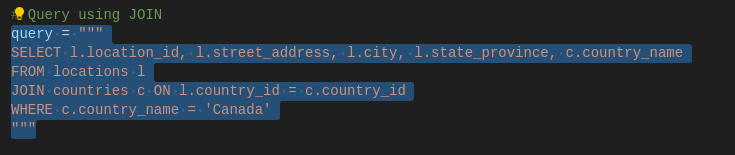
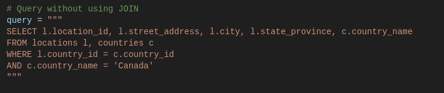
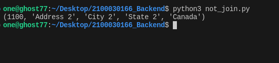

Q) Write a query to find the address (location_id, street_address, city, state_province,country_name) of Canada using join in Python (Input-We Can create a table in FrontEnd like using variables)
----

Q) Write a query to find the address (location_id, street_address, city, state_province, coutry_name) of Canada NOT using join in Python. (Input-We Can create a table in FrontEnd like using variables)
------

Create 2 tables Countries first and then create locations table since countries_id is used as a foreign key in locations table.

Step1: 
Create Table 
-------------
        Locations
        ---------
        USE mydb;

        -- Create the locations table
        CREATE TABLE locations (
            location_id INT PRIMARY KEY,
            street_address VARCHAR(255),
            city VARCHAR(255),
            state_province VARCHAR(255),
            country_id CHAR(2),
            FOREIGN KEY (country_id) REFERENCES countries (country_id)
        );

        -- Insert data into the locations table
        INSERT INTO locations (location_id, street_address, city, state_province, country_id)
        VALUES
            (1000, 'Address 1', 'City 1', 'State 1', 'IN'),
            (1100, 'Address 2', 'City 2', 'State 2', 'CA'),
            (1200, 'Address 3', 'City 3', 'State 3', 'BE'),
            (1300, 'Address 4', 'City 4', 'State 4', 'BR'),
            (1400, 'Address 5', 'City 5', 'State 5', 'US'),
            (1500, 'Address 6', 'City 6', 'State 6', 'CH'),
            (1600, 'Address 7', 'City 7', 'State 7', 'CN'),
            (1700, 'Address 8', 'City 8', 'State 8', 'DE'),
            (1800, 'Address 9', 'City 9', 'State 9', 'JP');

        Countries
        ---------
        USE mydb;
        -- Create the countries table
        CREATE TABLE countries (
            country_id CHAR(2) PRIMARY KEY,
            country_name VARCHAR(255)
        );

        -- Insert data into the countries table
        INSERT INTO countries (country_id, country_name)
        VALUES
            ('IN', 'India'),
            ('CA', 'Canada'),
            ('BE', 'Belgium'),
            ('BR', 'Brazil'),
            ('US', 'United States'),
            ('CH', 'Switzerland'),
            ('CN', 'China'),
            ('DE', 'Germany'),
            ('JP', 'Japan');

Step2:
-----
 connect to the databse change the password of the db and db name 

Step3:
-----
 execute join.py and not_join.py

Step4:
-----
 Logic of Join
 --------------- 
 

 Logic of Not using Join
 ------------------------
 

Step5:
------
 We will get the same output for both of those but the logic is different in one logic we use "Join" and in another we use "Where" to achive the same ...... 

 Join Output

 

 NotJoin(Where) Output

 
